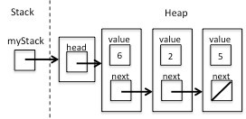

# THIS IS A LINUX ASSIGNMENT.

# Homework 1:  Linked-list implementation of a stack

While many of our assignments this semester will be done in the Xv6 operating system, this one will be accomplished in the normal Linux programming environment.  You may refer to the rubric below for information on how your program will be graded.

Before you begin, you might consider reading [this tutorial](http://pages.cs.wisc.edu/~remzi/OSTEP/lab-tutorial.pdf). It has some useful tips for programming in the C environment.  In particular, pay attention to any material covering pointers.

### Purpose
This assignment should be a review for you.  However, if it is not, then it will prepare you for future assignments in this class.  The amount of time you spend on this assignment will also be an indicator of the level of effort you may be spending on the programming assignments later in the course. 

### The stack data structure
A stack is a data structure that stores a set of values.  Unlike an array, which allows access to any element within that data structure, (i.e.  a[5]), only the last element that was added to a stack can be retrieved.  In a similar manner, values that are added to the stack can only be added to the “top” of the stack.  One can think of a stack as a data structure that behaves like a stack of pancakes.  You cannot remove a pancake at the bottom of the stack because the stack of pancakes will fall over.  You can only add or remove pancakes from the top of the stack.

In the abstraction for the stack data structure, values are added to the top of the stack with a command called push, and they are removed from it with a command called pop.  As an example, consider an empty stack A.  In order to add a value to the stack, we would use the push command and push a value onto the stack, with

```
push(A,5)
```

now the stack looks like
```
5
```

If we added two more values with push(A,2) push(A,6) the stack would look like
```
6
2
5
```

A call to pop would return the top-most value on the stack, which is 6, and the stack would now look like
```
2
5
```

### Implementation of a stack: Linked-lists

When it comes to developing the C code to implement the abstraction for the stack data type, there are many ways it can be done.  One way is to store the values in the stack in an array and add and remove values from that array with the push and pop commands.  Another way, which is the way you will be implementing a stack in this assignment, is to employ a linked-list. 

A linked-list is somewhat of a dynamic array that grows and shrinks as values are added to it.  Rather than being stored in a continuous block of memory, the values in the dynamic array are linked together with pointers.  Each element of a linked list is a structure that contains a value and a link to its neighbor.  The link is basically a pointer to another structure that contains a value and another pointer to another structure, and so on.  As an example, consider a linked list representation of the three values on the stack in the previous example.  In a linked-list, this would look like



A linked-list with a stack pointing to a head that points to the contents.

The first box on the left is a pointer to the type stackT  that is located in static memory which points to the stackT structure in dynamic memory.  This structure contains a pointer to the first element of the stack, or the head.  The type for this structure is given by the stackT type,
```c
typedef struct { 
    nodeT *head;
} stackT;
```

This contains a pointer called head to a structure of type nodeT, which is just a node in the linked list, and this type is given by
```c
typedef struct _nodeT { 
     valueT value; 
     struct _nodeT *next;
} nodeT;
```

Where the valueT is just a type of your choosing.  In this assignment we will have employ linked lists of character values, so that the type definition for valueT  is given by

```c
typedef char valueT;
```

The box in the last node with the diagonal line indicates that this pointer is the NULL pointer, in that it does not point to anything.

### The Assignment

Your job for this assignment is to use the above data structures and create the following public functions to manipulate the stack (which are declared in stack.h, which is provided in an attached zip file):
```c
stackT *NewStack(void);
void Push(stackT *stack, valueT value);  
valueT Pop(stackT *stack); 
void EmptyStack(stackT *stack);  
void FreeStack(stackT *stack);
bool IsEmpty(stackT *stack);
```
These functions are described as follows:

- NewStack: This function should return a pointer to a stackT type in the heap.  The head pointer should be initialized to NULL.  After using this function in the form myStack = NewStack(), myStack  is a pointer of type  stackT* that points to a new stackT type in the heap.
- Push: This function should take as its arguments a pointer to a stackT type and a value that is to be pushed onto the stack.  When you push a value onto the stack, you should:

    - Allocate space for a nodeT type in the heap.
    - Set the next field of that new node to point to the head node in the stack (NULL if there is no head).
    - Set the head field of the stack to point to the new node.

- Pop : This function should take as its argument a pointer to the stack and should return the value from the top of the stack.  It should then:

    - Return 0 and print out an error if the stack is empty.
    - Set the head field to point to the next node.
    - Free the space associated with the old node.

- EmptyStack: This function should take as its argument a pointer to a stackT and it should free up the space associated with every node in the linked list in the stack, but it should not free up the space associated with the stackT structure in memory, but should set the head pointer to NULL.
- FreeStack: This function should take as its argument a pointer to a stackT and should free up the space associated with the stackT struct allocated in dynamic memory.  This function should only free up memory associated with an empty stack, and should print an error to the screen when the user attempts to free a non-empty stack.
- IsEmpty: This function takes as its argument a pointer to a stackT in memory and returns true if it is empty, and false otherwise.  Your stack is defined as empty when its head pointer is NULL.  The function returns a boolean enumerated type, which is defined as

```c
typedef enum {false, true} bool;
```

### Getting started

You should copy the accompanying zip file (Assignment1.zip) from Canvas. 

Your job is to create the file stack.c, which contains definitions of the functions defined in stack.h.  You should include the `stack.h` header file as well as `stdio.h` in your version of `stack.c` (see `main.c` for an example).  The functions you create will be used in the main.c  program which performs a few tests with your stack functions.  You should not alter the main.c file, since this is the file that will be used to grade your assignment.

### Using the Makefile

The file makefile  is used as a project manager in Unix.  It compiles codes that have been changed and links precompiled object files together to make executable programs for you.  You use the makefile by typing “make” on the command prompt (in the same directory as the makefile.)

The format for statements in a makefile are given as
```bash
target: dependencies 
        command
```
Where the tabs (not spaces) before dependencies and command are very important! When you type “make” the makefile will execute the first target, “all:” Since you requested the “all” target, the make program looks at this line, and sees that the file that is required to create it is main.o.  The make program then looks to see if main.o is up to date by checking the entry for it in the makefile, which is given by other targets and dependencies.
```bash
main.o: main.c
        gcc --c main.c
```
This line says that the `main.o` object file depends on its source `main.c`.  If `main.c`  has been changed since the last compile, then `main.o` is created with the command listed, which is given by

```gcc --c main.c```

Once `main.o` and `stack.o` (in a similar manner) are created (and hence up to date), the command beneath the test statement is executed.   In this case, the command is

`gcc main.o stack.o –o Assignment1`

So when you type, “make”, the program “Assignment1” is created by linking the object files main.o and stack.o.  The stack.o file is a pre-compiled object file, which contains the solution.  Your job is to write your own stack.c file that compiles to create your own stack.o. 

To run “Assignment1” run the following from the command prompt:

`$./Assignment1`

A series of tests will run. 

You can also clean up your directory by typing “make clean”, and this will remove all of the object files and the executable from the directory.

### Deliverables and due date

You only need to submit your version of `stack.c` to Canvas by the due date.

This project must be done alone. Note that it is always OK to talk to others about your code, as well as help them debug their code. Copying code, however, is considered cheating. Don't do it! How will you learn that way? Read this for more info on what is OK and is not.  Include comments in the header section of your program that indicates who you spoke with and the general topic of the conversation.  Similar to a citation in a paper, this will prevent you from being accused of cheating should very similar methods, names, etc. be used in your programs.

The following is the zip file of `runValgrind.sh`, `main.c`, `stack.h`, and `Makefile` called Assignment1.zip

Be aware that you can use any environment to develop this project, but that the target machine is a Debian based Linux virtual machine.
